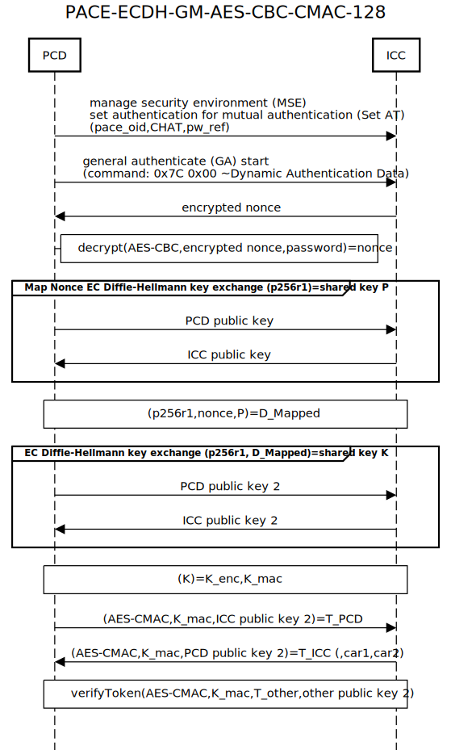

### PACE protocol implementation ###

PACE(.py) protocol [BSI TR3110] implementation for PCD by [Tobias Senger](https://github.com/tsenger/pypace) implementing PACE-ECDH-GM-AES-CBC-CMAC-128 with elliptic curve static domain parameters Brainpool P-256-r1.
- key exchange: ECDH on [Brainpool P-256-r1](https://tools.ietf.org/html/rfc5639#section-3.4)
- mapping: generic (generic group operations)
- symmetric cipher: AES-CBC 128Bit key length
- authentication token T: AES-CMAC 128Bit key length



See [BSI TR3110] part2 3.2.1 for cryptographic overview and [BSI TR3110] part3 B.1, B.11 for message exchange overview.

Other implementations of the PACE Protocol supporting more variants are [JMRTD](https://static.javadoc.io/org.jmrtd/jmrtd/0.6.4/org/jmrtd/protocol/PACEProtocol.html) in Java or [OpenPACE](https://github.com/frankmorgner/openpace) in C.

[BSI TR3110]: https://www.bsi.bund.de/EN/Publications/TechnicalGuidelines/TR03110/BSITR03110-eIDAS_Token_Specification.html

| parameter | description  |
|-----------|--------------|
| pace_oid | PACE-ECDH-GM-AES-CBC-CMAC-128 algorithm identifier |
| CHAT | the Certificate Holder Authorization Template (CHAT) to denote role and read/write access rights |
| pw_ref | contains the password type {1:MRZ,2:CAN,3:PIN,4:PUK}|
| car   |  Certification Authority Reference  |
| T_other   | T_PCD for ICC and T_ICC for PCD   |


```
https://sequencediagram.org source:
title PACE-ECDH-GM-AES-CBC-CMAC-128
PCD->ICC:manage security environment (MSE)\nset authentication for mutual authentication (Set AT)\n(pace_oid,CHAT,pw_ref)
#box over ICC,PCD: pace_oid~domain parameters D\n-key exchange ECDH, EC domain parameters: Brainpool P-256-r1\n-mapping: generic (group operation)\n-symmetric cipher: AES-CBC 128Bit key length\n-authentication token T: AES-CMAC 128Bit key length
PCD->ICC:general authenticate (GA) start\n(command: 0x7C 0x00 ~Dynamic Authentication Data)
ICC->PCD:encrypted nonce
box right of PCD:decrypt(AES-CBC,encrypted nonce,password)=nonce
group Map Nonce EC Diffie-Hellmann key exchange (p256r1)=shared key P
PCD->ICC:PCD public key
ICC->PCD:ICC public key
end
box over ICC,PCD:(p256r1,nonce,P)=D_Mapped
group EC Diffie-Hellmann key exchange (p256r1, D_Mapped)=shared key K
PCD->ICC:PCD public key 2
ICC->PCD:ICC public key 2
end
box over ICC,PCD:(K)=K_enc,K_mac
PCD->ICC:(AES-CMAC,K_mac,ICC public key 2)=T_PCD
ICC->PCD:(AES-CMAC,K_mac,PCD public key 2)=T_ICC (,car1,car2)
box over ICC,PCD:verifyToken(AES-CMAC,K_mac,T_other,other public key 2)
```
